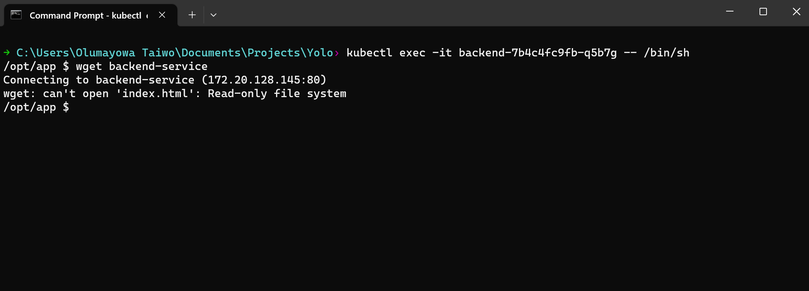
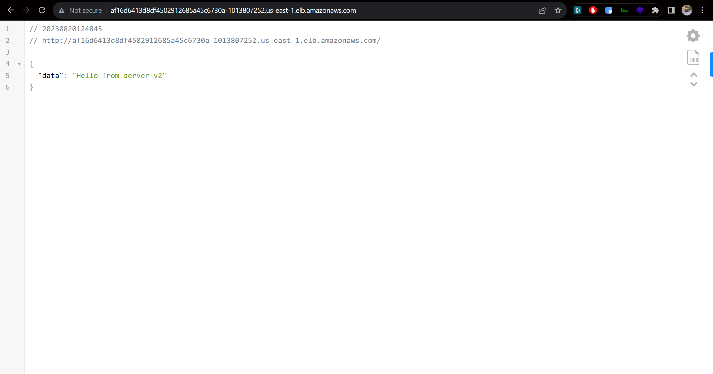
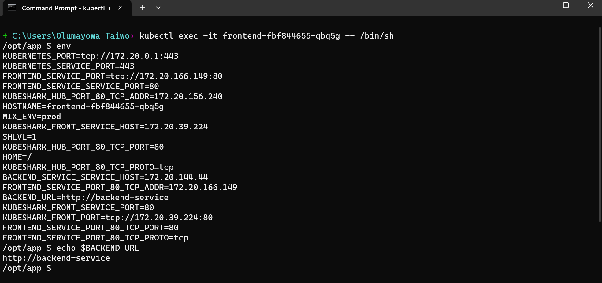
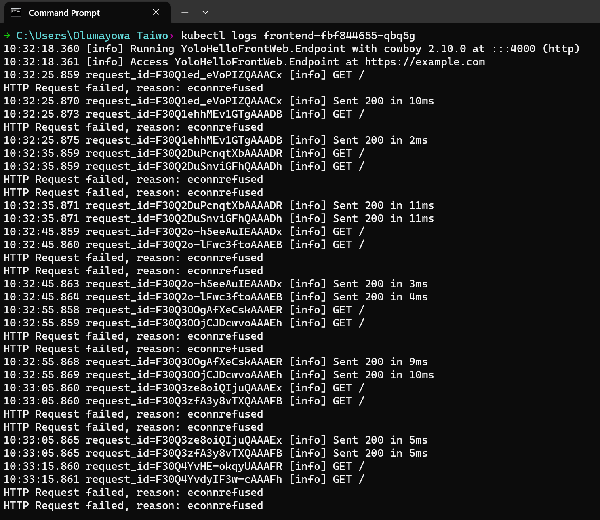

## Architecture

The app consists of two deployments which are `frontend`, and `backend`. The frontend connects to the backend via the `backend-service`, whose URL is set by an ENV variable named `BACKEND_URL` whose value is supplied to the frontend pods by a ConfigMap named `frontend-configmap`.

The app is deployed on an EKS cluster which is provisioned in a VPC. The whole infrastructure was provisioned using terraform, and the app was deployed using Helm.

You can view a detailed map of the resources the terraform scripts create by uploading the [plan.json](Infrastructure/plan.json) file [here](https://hieven.github.io/terraform-visual/).


### VPC

The VPC was provisioned using the [VPC Terraform module](https://registry.terraform.io/modules/terraform-aws-modules/vpc/aws/latest). The module helps with compactness of code, and also allows provisioning many VPC-related resources by just specifying their conditions and/or values. I provisioned public subnets for loadBalancers, private subnets for kubernetes nodes, and intra subnets for EKS controlplane resources. This is the recommended way by AWS. The resources all spanned across three availability zones.
I was also able to provision a single NAT gateway for the VPC, an internet gateway, a private route table, and a public route table too (the route tables were automatically created by the VPC module). The VPC module provisioned the route tables with the least routes needed, and they were more than okay for my use-case.


### EKS

The EKS cluster was provisioned with the [EKS Terraform module](https://registry.terraform.io/modules/terraform-aws-modules/eks/aws/latest). It consists of two nodegroups, one uses on-demand instances, and the other uses spot instances. This was done for cost savings. The EKS module automatically creates and configures the recommended security groups for the EKS cluster according to AWS best practices.
An OIDC provider was also deployed, making it easier to create and grant permissions to service accounts needed by some resources (e.g. external-dns, and cluster-autoscaler).
I deployed two types of auto-scalers in the EKS cluster: a horizontal pod autoscaler (HPA), and a cluster autoscaler (CA).

A horizontal pod autoscaler works by getting metrics (CPU, or memory) from the target pods in a cluster, and it will add more pods or delete more pods based on the set target limit, and the difference between the minimum pods, maximum pods, and the actual number of pods. It needs the metrics server deployed for it to be able to work. Athough you can define HPA in the deployments, I prefer managing it as a separate configuration because it's easier that way.

To test HPA, we first check the number of pods running in the default namespace with `kubectl get pods`

```sh
$ kubectl get pods
NAME                            READY   STATUS    RESTARTS   AGE
backend-7b4c4fc9fb-8frmf        1/1     Running   0          7m8s
backend-7b4c4fc9fb-tx6f8        1/1     Running   0          7m8s
external-dns-586d768cdc-p2nwm   1/1     Running   0          7m8s
frontend-fbf844655-cqkk2        1/1     Running   0          7m8s
frontend-fbf844655-rjt4j        1/1     Running   0          7m8s

```

then we'll run the following commands to simulate load on the pods (I set the target limits very low so they will be met easily scaling will happen quickly):

```sh
kubectl run -i --tty load-generator --rm --image=busybox --restart=Never -- /bin/sh -c "while sleep 0.01; do wget -q -O- http://frontend-service; done"

kubectl run -i --tty load-generator2 --rm --image=busybox --restart=Never -- /bin/sh -c "while sleep 0.01; do wget -q -O- http://backend-service; done"

```

Then after some minutes, open another terminal window and run `kubectl get pods`, which should show you that the pods have scaled up.

```sh
$ kubectl get pods
NAME                            READY   STATUS    RESTARTS   AGE
backend-7b4c4fc9fb-8frmf        1/1     Running   0          10m
backend-7b4c4fc9fb-b9fht        1/1     Running   0          34s
backend-7b4c4fc9fb-dfl6l        1/1     Running   0          34s
backend-7b4c4fc9fb-gnr8h        1/1     Running   0          49s
backend-7b4c4fc9fb-tx6f8        1/1     Running   0          10m
backend-7b4c4fc9fb-wk5nh        1/1     Running   0          34s
external-dns-586d768cdc-p2nwm   1/1     Running   0          10m
frontend-fbf844655-cqkk2        1/1     Running   0          10m
frontend-fbf844655-rjt4j        1/1     Running   0          10m
load-generator2                 1/1     Running   0          73s

```
As you can se, the number of the backend pods has increased (I ran the second comand).


Cluster autoscaler on the other hand scales the kubernetes nodes based on the amount of pods on a node, and the resources they consume. Once the resources consumed by the pods are close to the limits of the resources available on the nodes, cluster autoscaler creates and adds more nodes to the cluster automatically. This can be tested by first running `kubectl get nodes` to see the number of nodes running at the time

```sh
$ kubectl get nodes
NAME                           STATUS   ROLES    AGE   VERSION
ip-10-10-10-108.ec2.internal   Ready    <none>   19m   v1.27.3-eks-a5565ad
ip-10-10-18-154.ec2.internal   Ready    <none>   19m   v1.27.3-eks-a5565ad

```


then running either `kubectl scale --replicas=60 deployment frontend` or `kubectl scale --replicas=60 deployment backend` to trigger cluster scaling

```sh
$ kubectl scale --replicas=60 deployment frontend
deployment.apps/frontend scaled

```


and after some minutes, when we run `kubectl get nodes`, you'll see that more nodes are being created and added to the cluster.

```sh
$ kubectl get nodes
NAME                           STATUS   ROLES    AGE   VERSION
ip-10-10-10-108.ec2.internal   Ready    <none>   21m   v1.27.3-eks-a5565ad
ip-10-10-18-154.ec2.internal   Ready    <none>   21m   v1.27.3-eks-a5565ad
ip-10-10-27-231.ec2.internal   Ready    <none>   53s   v1.27.3-eks-a5565ad
ip-10-10-37-76.ec2.internal    Ready    <none>   45s   v1.27.3-eks-a5565ad
ip-10-10-5-68.ec2.internal     Ready    <none>   31s   v1.27.3-eks-a5565ad

```

It checks if there are any unscheduled pods waiting to be scheduled, and if the resources available on the nodes aren't enough for those pods, it provisions more nodes and adds them to the cluster. It also watches nodes to determine if they are used/unused, and if a node stays unused for 10 minutes, it removes it from the cluster.

The cluster autoscaler type that I used is the auto0discovery type, so it uses the AWS recommended standards, and no values need to be set. It obeys the limits set in the node groups though, and they have to be changed when the workload on the claster gets larger so it can work properly.

I delpoyed all the ressources in the default namespace for ease of managing them because it is a minimal application, and also because I didn't have enough time to properly configure the logic for namespace to namespace communication. It will get complicated when multiple apps need to be deployed, so this isn't recommended in production. 


### Ingress

The frontend is exposed to the internet using a Load Balancer, and configuring it sometimes can be tiring, especially when you have to configure ingress controllers, ingress resources, DNS Hosted Zones, and then nameservers. That's where external-dns comes in. 
Using external DNS instead of the traditional kubernetes ingress controller means loadbalancers can be connected to Hosted Zones on the fly, thereby eliminating the need for manual configuration which might be tedious and/or problem-ridden. All that's needed is to create a loadbalancerand set the `external-dns.alpha.kubernetes.io/hostname` field to the name of the Hosted Zone, and it will take care of the rest. The only manual configuration that might be needed is if the domain name is not managed by Route53, in which case you'll need to take the nameservers from the Hosted Zone and configure them in your domain name registrar.


### Helm

I converted the kubernetes manifests in the [Manifests](Manifests) directory to Helm charts using the `helm create CHART_NAME` command, in my case, it was `helm create yolo_app`, after which I edited the kubernetes manifests to use variables for the properties I feel can be edited or customised, and I then created the variables in the values.yaml file for the helm chart.
I added all the resources under a single chart, and while this is acceptable even in production, it gets more difficult to manage when the number of deployments and apps increases significantly. Using a main chart, and multiple subcharts is the better way to go. It has the following advantages:

1. Ease of managing the charts.
2. Ease of releasing apps without being held back by other teams.


### Terraform

I used an Amazon S3 bucket to store the state file, and and a DynamoDB for state-locking. State-locking is very necessary because it enables you to lock the state while deploying or editing resources, so that no other person that has access to the remote state can deploy or edit the resources too. This ensures consistency of the resources, and also helps eliminate over-deployment of resources. I used this combination for the backend for the following reasons:

1. They are easier to implement for my use-case.
2. I don't have a terraform cloud account subscription. Terraform Cloud is what Hashicorp reccommends, but S3 and DynamoDB work perfectly well too.
3. Storing the state locally is not an option. (I stored the state-file for creating the [backend](Remotestate) locally though, that's bad practice, not recommended).


I also didn't use terraform workspaces for the following reasons:

1. Terraform uses the same backend for multiple workspaces. This can be an issue because of state locking due to the fact that other teams might want to deploy at the same time.
2. If a team corrupts the state in a workspace, it will affect all other workspaces and recovering the state might be tedious.
3. Having the same backend for multiple workspaces introduces significant infrastructure inconsistencies over time, and also increases operational overhead (trying to manage and correct the inconsistencies).


### Cluster Security

Apart from the security groups created and configured by the EKS module, I implemented the following security features:

1. I configured containers to run with non-root users.
2. I deactivated privilege escalation in the containers so if anybody gains access into the cluster, they can't run any exploits since they'll mostly need elevated privileges to do so.
3. Add `- NET_RAW` and `- ALL` to spec.container[0].securityContext.capabilities.drop in deployments to disable the `NET_RAW` capability so hackers can't exploit it.
4. I made the root filesystem read-only so no hacker can write to it even if they gain access into the cluster.


### Monitoring

While provisioning the VPC, I enabled VPC Flow Logs. This is to enable the use of CloudWatch logging later on where it can capture the network flow and events in the whole VPC. CloudWatch can also be integrated with DataDog for better log aggregation. I also enabled logs in the EKS cluster (api, controllerManager, and scheduler) for this same purpose.
Another way of monitoring the cluster is using Prometheus, Alert Manager, and Grafana dashboards. This is a very common setup for monitoring.
My go-to choice will be Fluentd with InfluxDb (to store time-series stamped logs).
Another setup which I've used in the past which gives very fine-grained control is using Istio as a Service Mesh, and using Jaeger for Open Telemetry, in combination with Prometheus, Alert manager, and Grafana. Open telemetry makes it easy to locate errors in Kubernetes clusters by monitoring data flow through the resources in the cluster.

### Issues

The frontend wouldn't communicate with the backend even though I properly configured the deployments and services, however, when I get into the pod and I run `wget backend-service`, I get a response.



I also get the correct response when I convert the backend-service to a LoadBalancer and I visit its URL from a browser.



And when I use [`kubeshark`](https://kubeshark.co/), I can view the network logs and see that the backend is not even receiving any requests from the frontend.
 
Getting into a frontend pod and listing the ENV variables gives the result below showing that the `BACKEND_URL` variable is set properly



and checking the pod's logs gives the following results:



This shows that the frontend pod is trying to reach `/` instead of `backend-service`. I might be missing something, but I've tried for more than one week to solve this issue but I couldn't because I have no access to the sourcecode, and Elixir is compiled, so i couldn't get any of the sourcecode anywhere inside the containers.
