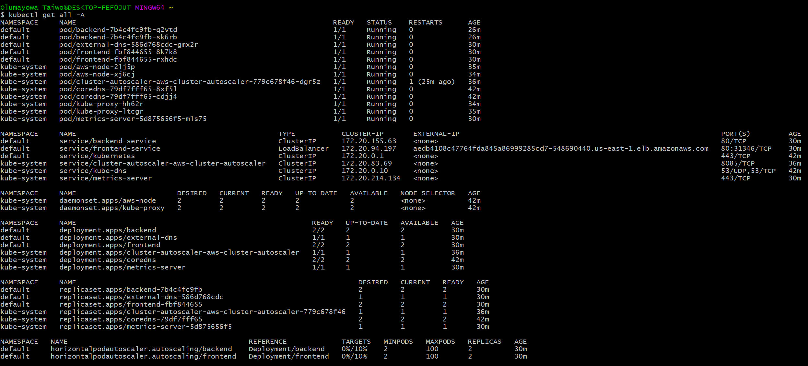
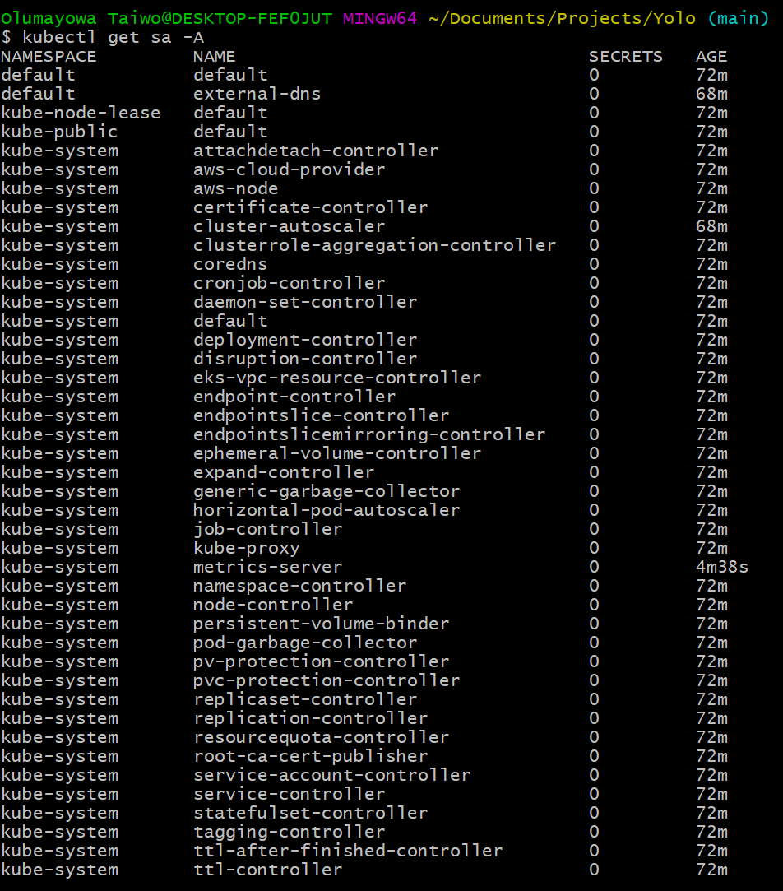

# Yolo
A Sportsbook DevOps Engineer Task. It consists of a minimal frontend and backend (both written in Elixir using Phoenix, Cowboy, Plug, and Php). It is configured to be deployed to AWS using Terraform and Helm.

### Demo**


**There is an issue with the frontend image. See "Issues" section in [DESIGN.md](DESIGN.md) for details.

### Architecture

## Deployment
First, you need to meet/get the following requirements. Click on the links to take you to the respective pages that will describe how to install and set them up properly.

1. An [AWS](https://aws.amazon.com) account.
2. [AWSCLI](https://docs.aws.amazon.com/cli/latest/userguide/getting-started-install.html)
3. [Kubectl](https://kubernetes.io/docs/tasks/tools/)
4. [Helm](https://helm.sh/docs/intro/install/)
5. [Terraform](https://developer.hashicorp.com/terraform/downloads)
   
Once the requirements are met, you need to create an ACCESS KEY on your AWS account and configure AWSCLI to use it. You can use [this](https://docs.aws.amazon.com/cli/latest/userguide/cli-authentication-user.html) tutorial if you don't know how to go about it.

The next step is to clone this repository and go into the folder using the following commands in your preferred terminal:

```sh
git clone https://github.com/olumayor99/Yolo.git
cd Yolo
```

Here is the folder structure of the repository:


We need to deploy the infrastructure before we can deploy the application itself. To deploy the infrastructure, we first need to customise some variables such as the names of the resources, the region to deploy them to, and a bunch of others. Run the following commands:

```sh
cd Infrastructure
vi variables.tf #**
```
**You can edit the file with any other editor you have, I just prefer using vi.

The [variables.tf](Infrastructure/variables.tf) file contains all the variables that can be cutomised to your taste. Below is how it looks.

```tf
variable "prefix" {
  type= string
  default     = "Yolo"
  description = "Prefix resource names"
}
variable "aws_region" {
  type= string
  default     = "us-east-1"
  description = "VPC region"
}
variable "vpc_cidr" {
  type= string
  default     = "10.10.0.0/16"
  description = "VPC CIDR range"
}
variable "domain_name" {
   type= string
   default= "drayco.com" # Replace with your own domain name
   description= "domain name"

}
```

After editing to your taste, you need to configure the terraform backend. In this case, we're using an S3 bucket to store the state, and a DynamoDB table to lock the state while deployment is ongoing. I'll asume that you have neither of these created, so I've written scripts to enable you provision them (if you want to create them manually and you don't know how to, use [this](https://docs.aws.amazon.com/AmazonS3/latest/userguide/create-bucket-overview.html) article, and [this](https://docs.aws.amazon.com/amazondynamodb/latest/developerguide/getting-started-step-1.html) one too) First you need to customise the script. Run the following commands (I'm assuming you're still in the Infrastructure directory):

```sh
cd ../RemoteState
vi backend.tf 
```

It should display a file like the one below

```tf
terraform {
  required_version = ">= 1.0"

  required_providers {
    aws = {
      source  = "hashicorp/aws"
      version = ">= 4.47"
    }
  }
}

provider "aws" {
  region = "us-east-1"
}

module "s3_bucket" {
  source = "terraform-aws-modules/s3-bucket/aws"

  bucket = "yolo-task-bucket-to-store-terraform-remote-state-s3" # Change this to a very unique name
  acl    = "private"

  control_object_ownership = true
  object_ownership         = "ObjectWriter"

  versioning = {
    enabled = true
  }

  tags = {
    Terraform   = "true"
    Environment = "dev"
  }
}

module "dynamodb_table" {
  source   = "terraform-aws-modules/dynamodb-table/aws"

  name     = "yolo-task-table-to-store-terraform-remote-state"  # Edit this to what you want
  billing_mode = "PAY_PER_REQUEST"
  hash_key     = "LockID"

  attributes = [
    {
      name = "LockID"
      type = "S"
    }
  ]

  tags = {
    Terraform   = "true"
    Environment = "dev"
  }
}
```

Save that, and then head back to the [Infrastructure](Infrastructure) folder using 

```sh
cd ../Infrastructure
```

and edit the [backend.tf](Infrastructure/backend.tf) using

```sh
vi backend.tf
```

Replace the key if you wish. Note that it must end with the ".tfstate" extension for it to work.

```tf
terraform {
  backend "s3" {
    bucket  = "yolo-task-bucket-to-store-terraform-remote-state-s3" # The S3 bucket name
    key     = "version3.tfstate" # Customise the prefix of ".tfstate", or you can leave it as it is
    region  = "us-east-1" # The region the S3 bucket was deployed in
    encrypt = "true"
    dynamodb_table = "yolo-task-table-to-store-terraform-remote-state"
  }
}
```

Once all that is done, confirm that you're in the [Infrastructure](Infrastructure) folder, then initialize the terraform backend and install the modules using 

```sh
terraform init
```
It is successful when you get a message like the one below:

```sh
selections it made above. Include this file in your version control repository
so that Terraform can guarantee to make the same selections by default when
you run "terraform init" in the future.

Terraform has been successfully initialized!

You may now begin working with Terraform. Try running "terraform plan" to see
any changes that are required for your infrastructure. All Terraform commands
should now work.

If you ever set or change modules or backend configuration for Terraform,
rerun this command to reinitialize your working directory. If you forget, other
commands will detect it and remind you to do so if necessary.
```

View the plan of the resources it will deploy using:

```sh
terraform plan
```

After seeing the plan and confirming the resources it will deploy, run the following command, and respond "yes" to the prompt to deploy the resources.

```sh
terraform apply
```

You can also run the following command to skip the prompt.

```sh
terraform apply --auto-approve
```

If it deploys all the resources successfully, you should get a response similar to the one below:

```sh
Releasing state lock. This may take a few moments...

Apply complete! Resources: 77 added, 0 changed, 0 destroyed.

Outputs:

cluster_endpoint = "https://25FCE35DA77117561CCBDD7D68D5778F.gr7.us-east-1.eks.amazonaws.com"
cluster_name = "Yolo-EKS"
cluster_region = "us-east-1"
cluster_security_group_id = "sg-0fd780659ed4c442d"
common_tags = {
  "Environment" = "dev"
  "Project" = "yolo"
}
domain_name = "drayco.com"
eks_ca_iam_role_arn = "arn:aws:iam::573763289578:role/Yolo-cluster-autoscaler"
hosted_zone_id = "Z0090123D8QUDP819VKC"
oidc_issuer = "oidc.eks.us-east-1.amazonaws.com/id/25FCE35DA77117561CCBDD7D68D5778F"
prefix = "Yolo"
private_subnets = [
  "subnet-00ebb9c10cec856e0",
  "subnet-0fb45e4d9b9f84a2e",
  "subnet-0a8e86f74f3990a25",
]
public_subnets = [
  "subnet-01a20d3877266b042",
  "subnet-0d0158b8937de7877",
  "subnet-0561dc9c4b4dd44e8",
]
vpc_id = "vpc-0b2a2b482a11f431f"
vpc_name = "Yolo-vpc"

```

The outputs displayed here are defined in the [outputs.tf](Infrastructure/outputs.tf) file. Please note the value of the `domain_name`, `hosted_zone_id`, `cluster_name`, and `cluster_region` fields, they will be needed in one of the next steps. The other outputs can also be saved, but they aren't really needed for now.

The scripts in the [Infrastructure](Infrastructure) directory will deploy a VPC, an EKS cluster, and all the other needed resources such as an internet gateway, subnets, DNS Hosted Zone, security groups, NAT gateways, Node Groups, Service Accounts, etc. These resources are essential for the app to function properly.

Now you need to add the cluster to your .kubeconfig file. Use the following command:

```sh
aws eks update-kubeconfig --region us-east-1 --name Yolo-EKS
```

`us-east-1` should be replaced with the value of the `cluster_region` output, and `Yolo-EKS` with the value of the `cluster_name` output respectively.

The next step is to deploy the app to the cluster. This is done using the helm chart located in the [HelmCharts](HelmCharts) directory. Before deployment though, we need to edit the [values.yaml](HelmCharts/yolo_app/values.yaml) file. Run the following commands to do that:

```sh
cd ../HelmCharts/yolo_app/
vi values.yaml
```

It's contents are similar to the following

```yaml
# Default values for yolo_app.
# This is a YAML-formatted file.
# Declare variables to be passed into your templates.

# Frontend Deployment
frontend:
  metadata:
    name: frontend
  replicaCount: 2
  containerName: frontend-container
  image:
    repository: public.ecr.aws/v5d9e1r0/yolo/yolo_hello_front:v0.0.1
    pullPolicy: Always
    selectorLabels:
      app: frontend
    labels:
      app: frontend

# Backend Deployment
backend:
  metadata:
    name: backend
  replicaCount: 2
  containerName: backend-container
  image:
    repository: public.ecr.aws/v5d9e1r0/yolo/yolo_hello_back:v0.0.1
    pullPolicy: Always
    selectorLabels:
      app: backend
    labels:
      app: backend

# Frontend Service
frontendService:
  name: frontend-service
  annotations:
    external-dns.alpha.kubernetes.io/hostname: drayco.com
  selector:
    app: frontend
  type: LoadBalancer

# Backend Service
backendService:
  name: backend-service
  selector:
    app: backend
  type: ClusterIP

# Frontend Horizontal Pod Autoscaler
frontendHPA:
  minReplicas: 2
  maxReplicas: 8
  averageUtilization: 10

# Backendend Horizontal Pod Autoscaler
backendHPA:
  minReplicas: 2
  maxReplicas: 8
  averageUtilization: 10

# ExternalDNS
externalDNS:
  domainFilter: drayco.com
  txtOwnerID: Z046868710106H7HIXYYF

# Cluster Autoscaler
clusterAutoscaler:
  clusterName: YoloEKS

# Frontend Configmap
frontendCMData:
  BACKEND_URL: http://backend-service

```

Replace the `clusterName` value with the `cluster_name` output value that you noted earlier, `domainFilter` with the `domain_name` output value, and then the value of `txtOwnerID` with the value of the `hosted_zone_id`.

After completing this step, run the following command to view the helm templates:

```sh
helm template yolo_app
```

then run this to make sure the helm templates are properly linted

```sh
helm lint yolo_app
```

and then deploy the app with

```sh
helm install yolo yolo_app
```

`yolo` is the name of the release, wile `yolo_app` is the name of the chart. You can change `yolo` to any name you want, but you can't change the name of the chart.

After running this command, you should get a response similar to the one below:

```sh
$ helm install yolo yolo_app
NAME: yolo
LAST DEPLOYED: Sun Aug 20 05:18:02 2023
NAMESPACE: default
STATUS: deployed
REVISION: 1
TEST SUITE: None

```

Now when you run `kubectl get all -A`, you should get a response similar to the image below:



and `kubectl get sa -A`, gives a response similar to the image below:



## Viewing the app

If the domain name set in the `domain_name` variable in [variables.tf](Infrastructure/variables.tf)  is managed by Route53, just input it in a browser and you should be able to view the page. Follow the steps below if it isn't.

1. In your AWS account, go to Route53, then click on `Hosted Zones`
   
   

2. Click on the domain name you used in your terraform code, and copy the highlighted nameservers. They are in the NS record.
   
   

3. Take them to the domain name registrar of your domain name and add then to the domain name's settings. Wait for a while and visit the domain name in a browser and you should be able to access the page.
   
## Destroying

1. Run `helm delete yolo` and wait for it to finish.
2. Then go into the [Infrastructure](Infrastructure) folder and run `terraform destroy`, at the prompt, respond "yes".
3. You can also run `terraform destroy --auto-approve` to skip the propmt and destroy the infrastructure.
4. Sometimes the infrastructure isn't destroyed completely because of the DNS Hosted Zone record.
   
   ```sh
   Error: deleting Route53 Hosted Zone (Z0090123D8QUDP819VKC): HostedZoneNotEmpty: The specified hosted zone contains non-required resource record sets and so cannot be deleted.
│       status code: 400, request id: d5a077ad-b731-449b-b945-dd47fcaf2d51
   ```
   
   Delete the highlighted records (`A`, and `TXT`) below and run step 2 or step 3 again, it will destroy all the resources completely.
   
   

5. Then go to the [RemoteState](RemoteState) dierectory and run step 2 or step 3 to delete the backend. If you created them manually, then go into your account and delete them manually.